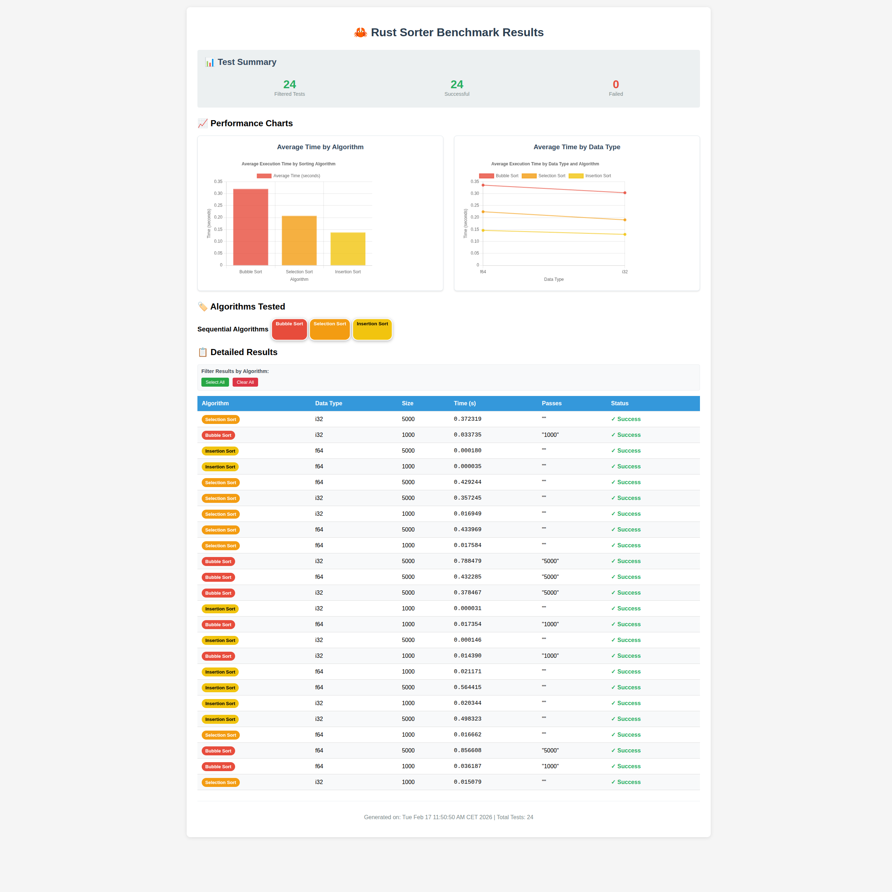

# 🦀 Rust Sorter Benchmark Suite

[](https://opensource.org/licenses/MIT)
[](https://www.rust-lang.org/)
[]()

A comprehensive collection of sorting algorithms implemented in Rust, featuring advanced benchmarking capabilities, parallel execution, GPU acceleration framework, and interactive performance analysis with dynamic HTML reports.

## 📋 Table of Contents

- [Overview](#overview)
- [Quick Start](#quick-start)
- [Implemented Algorithms](#implemented-algorithms)
- [Key Features](#key-features)
- [Usage](#usage)
- [Documentation](#documentation)
- [Project Structure](#project-structure)
- [Performance](#performance)
- [Contributing](#contributing)
- [License](#license)

## Overview

This project implements various sorting algorithms as modular, generic functions that work with any type implementing the `Ord` trait. The algorithms are organized in the `src/sorting/` directory for easy maintenance and extension.

The suite includes a sophisticated benchmarking system with parallel execution, multiple test profiles, and interactive HTML reports generated from static templates that dynamically load JSON data for efficient report generation.

## Quick Start

### Prerequisites

- Rust 1.70 or higher
- Cargo package manager
- Optional: GPU with Vulkan/Metal/D3D12 support for GPU acceleration

### Installation & Basic Usage

```bash
# Clone the repository
git clone https://github.com/AlessandroPerazzetta/sorter.git
cd sorter

# Build the project
cargo build --release

# Run a quick test
cargo run -- bubble random 1000

# Run the benchmark suite
./run_tests.sh
```

## Implemented Algorithms

### Sequential Algorithms

#### Bubble Sort
**Time Complexity:** O(n²) worst/average case, O(n) best case  
**Space Complexity:** O(1)  
**Stability:** Stable  
**In-place:** Yes

Bubble sort repeatedly steps through the list, compares adjacent elements and swaps them if they are in the wrong order. The pass through the list is repeated until the list is sorted.

#### Selection Sort
**Time Complexity:** O(n²) all cases  
**Space Complexity:** O(1)  
**Stability:** Unstable  
**In-place:** Yes

Selection sort divides the input list into two parts: a sorted sublist and an unsorted sublist. It repeatedly selects the smallest (or largest) element from the unsorted sublist and moves it to the end of the sorted sublist.

#### Insertion Sort
**Time Complexity:** O(n²) worst/average case, O(n) best case  
**Space Complexity:** O(1)  
**Stability:** Stable  
**In-place:** Yes

Insertion sort builds the final sorted array one item at a time. It is much less efficient on large lists than more advanced algorithms such as quicksort, heapsort, or merge sort.

#### Merge Sort
**Time Complexity:** O(n log n) all cases  
**Space Complexity:** O(n)  
**Stability:** Stable  
**In-place:** No (requires additional space)

Merge sort is a divide and conquer algorithm that divides the input array into two halves, calls itself for the two halves, and then merges the two sorted halves.

#### Quick Sort
**Time Complexity:** O(n log n) average case, O(n²) worst case  
**Space Complexity:** O(log n)  
**Stability:** Unstable  
**In-place:** Yes

Quicksort is a divide-and-conquer algorithm. It works by selecting a 'pivot' element and partitioning the other elements into two sub-arrays, according to whether they are less than or greater than the pivot.

#### Heap Sort
**Time Complexity:** O(n log n) all cases  
**Space Complexity:** O(1) auxiliary  
**Stability:** Unstable  
**In-place:** Yes

Heap sort is a comparison-based sorting technique based on a Binary Heap data structure. It is similar to selection sort where we first find the maximum element and place it at the end.

### Parallel Algorithms

#### Parallel Bubble Sort
A parallelized version of bubble sort using multiple threads for concurrent comparisons and swaps.

#### Parallel Merge Sort
A parallel implementation of merge sort that divides the sorting work across multiple CPU cores.

### GPU Algorithms

#### GPU Sort (Merge-based)
**Time Complexity:** O(n log n) all cases  
**Space Complexity:** O(n)  
**Stability:** Stable  
**In-place:** No  
**GPU-accelerated:** Framework ready (CPU fallback)

GPU-accelerated sorting using merge sort algorithm optimized for GPU parallelism. Framework is implemented with CPU fallback while GPU acceleration is under development.

#### GPU Bitonic Sort
**Time Complexity:** O(n log² n) all cases  
**Space Complexity:** O(1)  
**Stability:** Unstable  
**In-place:** Yes  
**GPU-accelerated:** Framework ready (CPU fallback)

GPU-accelerated bitonic sort, well-suited for GPU implementation due to its parallel nature. Framework is implemented with CPU fallback while GPU acceleration is under development.

> 📖 **Learn more:** See [GPU Implementation Guide](docs/gpu.md) and [GPU Refactoring Plan](docs/gpu_refactor_plan.md) for detailed information about the GPU acceleration framework.

### Data Persistence

The sorter supports saving and loading test data for reproducible benchmarking, as well as saving sorting results for detailed analysis:

- **Save Data**: Use `--save-data <file>` to save generated test data to a file
- **Load Data**: Use `--load-data <file>` to load previously saved data instead of generating new data
- **Save Results**: Use `--save-results <dir>` to save sorting results as JSON files to a directory
- **File Format**: Text files with one value per line for data; JSON files for results
- **Validation**: Loaded data is validated for correct format and content

This feature enables consistent performance testing with identical input data across different runs and preserves detailed sorting results for further analysis.

## Usage

### Building and Running

```bash
# Build the project
cargo build --release

# Run with specific algorithm, data pattern, and type
cargo run -- <algorithm> <data_pattern> <size>

# Specify data type (default: i32)
cargo run -- --data-type <type> <algorithm> <data_pattern> <size>

# Save generated data to file
cargo run -- --save-data data.txt <algorithm> <data_pattern> <size>

# Load data from file instead of generating
cargo run -- --load-data data.txt --data-type <type> <algorithm> <data_pattern> <size>

# Save sorting results as JSON to directory
cargo run -- --save-results ./results <algorithm> <data_pattern> <size>

# Examples
cargo run -- bubble random 1000
cargo run -- --data-type f64 quick sorted 500
cargo run -- --data-type string merge reverse 1000
cargo run -- --save-data input_data.txt bubble random 500
cargo run -- --load-data input_data.txt --data-type i16 quick sorted 500
cargo run -- --parallel --data-type u64 merge reverse 2000
cargo run -- gpu-sort random 1000
cargo run -- gpu-bitonic reverse 1000
cargo run -- --save-results ./results bubble random 1000
```

### Supported Data Types

The sorter supports multiple data types for comprehensive testing:

- **Integer types:** `i8`, `i16`, `i32` (default), `i64`, `u8`, `u16`, `u32`, `u64`
- **Floating point:** `f32`, `f64`
- **Strings:** `string`

### Data Patterns

- `random`: Randomly generated values
- `sorted`: Already sorted in ascending order
- `reverse`: Sorted in descending order (reverse sorted)
- `nearly`: Mostly sorted with small random swaps
- `duplicates`: Many duplicate values
- `identical`: All elements have the same value
- `alternating`: Alternating high/low values

### Automated Benchmarking

The suite includes a comprehensive benchmarking script with multiple optimization features:

```bash
# Show help and usage information
./run_tests.sh --help

# Run light profile (6 tests - fast for development)
./run_tests.sh

# Run medium profile (40 tests - balanced)
./run_tests.sh --profile medium

# Run full profile (200 tests - comprehensive)
./run_tests.sh --profile full

# Custom data sizes
./run_tests.sh --size "100,500,1000,5000"

# Parallel execution (4 jobs by default)
./run_tests.sh --parallel

# Parallel execution with custom job limit
./run_tests.sh --parallel --max-jobs 8

# Save generated data for reproducible testing
./run_tests.sh --save-data ./benchmark_data --profile light

# Load saved data for consistent benchmarking
./run_tests.sh --load-data ./benchmark_data --profile light

# Save sorting results as JSON files
./run_tests.sh --save-results ./results --profile light

# JSON-only execution (no reports generated)
./run_tests.sh --json-only

# Generate HTML report from existing JSON
./generate_reports.sh --input-json reports/benchmark_results_*.json --html

# Generate both HTML and text reports
./generate_reports.sh --input-json reports/benchmark_results_*.json --html --text
```

### Test Profiles

- **light**: 3 algorithms × 2 data types × 1 size = 6 tests (fast, for development)
- **medium**: 5 algorithms × 4 data types × 2 sizes = 40 tests (balanced)
- **full**: 8 algorithms × 5 data types × 5 sizes = 200 tests (comprehensive)

### Command Line Options

#### Main Program (sorter) Options

| Flag | Description | Example |
|------|-------------|---------|
| `--parallel` | Use parallel algorithms where available | `cargo run -- --parallel merge random 1000` |
| `--save-data <file>` | Save generated data to file | `cargo run -- --save-data data.txt bubble random 100` |
| `--load-data <file>` | Load data from file instead of generating | `cargo run -- --load-data data.txt bubble random 100` |
| `--save-results <dir>` | Save sorting results as JSON to directory | `cargo run -- --save-results ./results bubble random 100` |
| `<algorithm>` | Sorting algorithm to use | `bubble`, `quick`, `merge`, etc. |
| `<data_type>` | Type of test data | `random`, `sorted`, `reverse`, etc. |
| `<size>` | Size of the data set | `1000`, `5000`, etc. |

#### run_tests.sh Options

| Flag | Description | Example |
|------|-------------|---------|
| `-h, --help` | Show help message | `./run_tests.sh --help` |
| `--profile` | Test profile (light/medium/full) | `./run_tests.sh --profile medium` |
| `--size, --sizes` | Custom data sizes (comma-separated) | `./run_tests.sh --size "100,500,1000"` |
| `--save-data` | Save generated data to directory | `./run_tests.sh --save-data ./data` |
| `--load-data` | Load data from directory instead of generating | `./run_tests.sh --load-data ./data` |
| `--save-results` | Save sorting results as JSON files to directory | `./run_tests.sh --save-results ./results` |
| `--json-only` | Run tests and generate JSON only | `./run_tests.sh --json-only` |
| `--parallel` | Run tests in parallel | `./run_tests.sh --parallel` |
| `--max-jobs` | Maximum parallel jobs (default: 4) | `./run_tests.sh --parallel --max-jobs 8` |
| `--html` | Generate HTML report | `./run_tests.sh --html` |
| `--text` | Generate text report | `./run_tests.sh --text` |

#### generate_reports.sh Options

| Flag | Description | Example |
|------|-------------|---------|
| `--input-json` | Input JSON file path | `./generate_reports.sh --input-json results.json` |
| `--html` | Generate HTML report | `./generate_reports.sh --html` |
| `--text` | Generate text report | `./generate_reports.sh --text` |

### Output Files

Reports are saved in the `reports/` directory with timestamps:

- `reports/benchmark_results_YYYYMMDD_HHMMSS.json` - JSON results (always generated)
- `reports/benchmark_results_YYYYMMDD_HHMMSS.txt` - Detailed text results (optional)
- `reports/benchmark_results_YYYYMMDD_HHMMSS.html` - Interactive HTML report with charts (optional)

Individual sorting results can also be saved as JSON files using the `--save-results` option:

- `<dir>/algorithm_datapattern_size_datatype_timestamp.json` - Individual result files containing algorithm info, execution time, and sorted data

### Data Types

- `random`: Random integers between 0 and 9999
- `sorted`: Already sorted integers (0 to size-1)
- `reverse`: Reverse sorted integers (size-1 to 0)
- `nearly`: Mostly sorted with some random swaps
- `duplicates`: Many duplicate values (0-99 range)

## Documentation

This project includes comprehensive documentation for learning and development:

### 📚 Learning Resources
- **[Learning Rust Through Sorting](docs/learning.md)** - Comprehensive guide to Rust concepts using sorting algorithms
- **[Technical Documentation](docs/documentation.md)** - Complete project reference and API documentation
- **[GPU Implementation Guide](docs/gpu.md)** - Deep dive into GPU acceleration framework
- **[GPU Refactoring Plan](docs/gpu_refactor_plan.md)** - Roadmap for implementing full GPU acceleration

### 🎯 Educational Value
This project serves as both a performance tool and an educational resource for:
- Learning Rust programming through practical algorithms
- Understanding algorithm analysis and complexity
- Exploring parallel and GPU computing concepts
- Studying software architecture and benchmarking

## Key Features

### 🚀 Performance Optimizations

#### Parallel Execution
- Run multiple tests concurrently using `--parallel` flag
- Configurable job limits with `--max-jobs` parameter
- Significant speedup on multi-core systems
- Maintains accurate timing measurements per test

#### Separation of Concerns
- `--json-only` flag for execution-only mode
- Separate `generate_reports.sh` for report generation
- Regenerate reports from JSON without re-running tests
- Perfect for CI/CD pipelines and iterative analysis

### 📊 Interactive Reports

HTML reports are generated from a static template that dynamically loads JSON data for fast report generation and real-time updates:
- **Performance Charts**: Bar charts and line graphs using Chart.js
- **Algorithm Comparison**: Average times by algorithm and data type
- **Interactive Filtering**: Filter results by algorithm category
- **Detailed Results Table**: Complete test results with **sortable columns** (Algorithm, Data Type, Size, Time, Passes, Status)
- **Summary Statistics**: Success/failure counts and totals
- **Dynamic Loading**: Reports load fresh JSON data without regeneration



*Generate interactive reports with: `./run_tests.sh --html`*

### 🎯 Flexible Testing

- **Custom Profiles**: Light (development), medium (balanced), full (comprehensive)
- **Custom Sizes**: User-defined data sizes with validation
- **Modular Design**: Easy to add new algorithms and data types
- **Comprehensive Validation**: Input validation and error handling

## Project Structure

```
src/
├── main.rs              # Main program with CLI and measurement system
├── sorting/             # Sorting algorithms module
│   ├── mod.rs          # Module declarations
│   ├── bubble.rs       # Bubble sort implementation
│   ├── selection.rs    # Selection sort implementation
│   ├── insertion.rs    # Insertion sort implementation
│   ├── merge.rs        # Merge sort implementation
│   ├── quick.rs        # Quick sort implementation
│   ├── heap.rs         # Heap sort implementation
│   ├── gpu.rs          # GPU acceleration framework
│   ├── parallel_bubble.rs  # Parallel bubble sort
│   └── parallel_merge.rs   # Parallel merge sort
└── data/                # Data generation module
    ├── mod.rs          # Module declarations
    └── generators.rs   # Various data generators for testing

docs/                    # Comprehensive documentation
├── documentation.md    # Technical reference
├── learning.md         # Rust learning guide
├── gpu.md             # GPU implementation guide
└── gpu_refactor_plan.md # GPU development roadmap

run_tests.sh             # Main benchmarking script
generate_reports.sh      # Report generation from JSON
reports/                 # Generated reports directory
.github/
└── copilot-instructions.md # Development guidelines
```

## Performance Measurement

The program includes a built-in measurement system that tracks:

- **Execution time**: Measured using high-precision timers within Rust
- **Pass count**: Number of passes performed (for applicable algorithms)
- **Data validation**: Shows first and last elements to verify correctness

### Example Output

```
Algorithm: bubble
Data type: random
Size: 1000
Time taken: 0.012345 seconds
Passes: 1000
First 10 elements: [0, 1, 2, 3, 4, 5, 6, 7, 8, 9]
Last 10 elements: [990, 991, 992, 993, 994, 995, 996, 997, 998, 999]
```

## Performance Comparison

| Algorithm | Best | Average | Worst | Space | Stable | Parallel | GPU Status |
|-----------|------|---------|-------|-------|--------|----------|------------|
| Bubble | O(n) | O(n²) | O(n²) | O(1) | Yes | Yes | - |
| Selection | O(n²) | O(n²) | O(n²) | O(1) | No | No | - |
| Insertion | O(n) | O(n²) | O(n²) | O(1) | Yes | No | - |
| Merge | O(n log n) | O(n log n) | O(n log n) | O(n) | Yes | Yes | - |
| Quick | O(n log n) | O(n log n) | O(n²) | O(log n) | No | No | - |
| Heap | O(n log n) | O(n log n) | O(n log n) | O(1) | No | No | - |
| GPU Sort | O(n log n) | O(n log n) | O(n log n) | O(n) | Yes | Yes | Framework Ready |
| GPU Bitonic | O(n log² n) | O(n log² n) | O(n log² n) | O(1) | No | Yes | Framework Ready |

*GPU Status: Framework implemented with CPU fallback. Full GPU acceleration planned for future releases.*

## Examples

### Basic Usage
```bash
# Quick development test
./run_tests.sh

# Comprehensive benchmarking
./run_tests.sh --profile full --parallel --max-jobs 8 --html

# Custom analysis
./run_tests.sh --size "100,1000,10000" --parallel --json-only
./generate_reports.sh --input-json reports/benchmark_results_*.json --html --text
```

### CI/CD Integration
```bash
# JSON-only execution for automated testing
./run_tests.sh --profile medium --json-only

# Report generation in separate step
./generate_reports.sh --input-json results.json --html
```

## Future Enhancements

### 🚀 GPU Acceleration (In Progress)
- **Phase 1**: Type-specific GPU sorting implementation (u32, i32, f32, f64)
- **Phase 2**: Advanced algorithms (Radix sort, optimized Bitonic sort)
- **Phase 3**: Multi-GPU support and performance optimization
- **Phase 4**: Full integration with benchmarking system

### 📈 Additional Algorithms
- Counting sort, Radix sort, Bucket sort
- Shell sort, Comb sort, Timsort
- External sorting for large datasets

### 🔧 Enhanced Features
- Memory usage profiling and optimization
- Algorithm visualization tools
- Comparative analysis across different hardware
- Export capabilities (CSV, Parquet, etc.)
- Web-based interactive dashboard

### 🎯 Research Applications
- Performance analysis of sorting networks
- GPU computing education and research
- Algorithm optimization studies
- Parallel computing benchmarks

### For Algorithm Implementations:
1. Create a new module in `src/sorting/`
2. Update `src/sorting/mod.rs` to include the new module
3. Implement the algorithm as a generic function with proper documentation
4. Add comprehensive tests in appropriate test files
5. Update documentation in `docs/` directory
6. Update this README with algorithm details

### For Documentation:
1. Update relevant files in `docs/` when code changes
2. Ensure examples are current and functional
3. Add performance benchmarks for new features
4. Update README badges and links as needed

### Development Guidelines:
- Follow Rust best practices and idioms
- Add unit tests for all new functionality
- Update benchmarks when performance characteristics change
- Maintain compatibility with existing APIs
- Run `./run_tests.sh` to validate changes

### Educational Contributions:
- Algorithm explanations and complexity analysis
- Performance optimization examples
- GPU computing tutorials
- Research applications and case studies

## License

This project is open source and available under the MIT License. See [LICENSE](LICENSE) for details.
